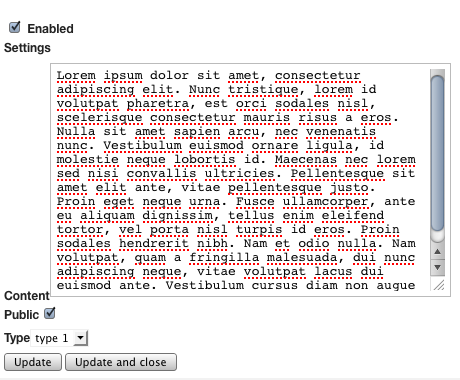

.. index::
    double: Reference; Form types
    single: Transformers

Form types and data transformers
================================

The `AdminBundle` is shipped with custom form types and data transfomers in order to handle the different model's workflows and lifecycle.

Form types
----------

* ``Sonata\AdminBundle\Form\Type\AdminType``: this type is linked to an `Admin` class and the field construction is delegated to an Admin class,
* ``Sonata\Form\Type\CollectionType``: this type works like the native ``CollectionType`` but contains two extra features:

    * the data layer is abstracted to work with any implemented layer,
    * a delete option is added so a collection entry can be deleted.
* ``Sonata\AdminBundle\Form\Type\ModelType``: this type works like the native ``EntityType`` but this internal is abstracted to work with any implemented layer.
* ``Sonata\Form\Type\ImmutableArrayType``: this type allows to edit a fixed array, like a settings array.

Let's say, the object has settings properties::

    class Page
    {
        public $settings = [
            'content' => 'default content',
            'public' => true,
            'type' => 1
        ];
    }

Now you can edit the settings array with::

    namespace Sonata\PageBundle\Admin;

    use Sonata\AdminBundle\Admin\AbstractAdmin;
    use Sonata\AdminBundle\Form\FormMapper;
    use Sonata\Form\Type\ImmutableArrayType;

    final class PageAdmin extends AbstractAdmin
    {
        protected function configureFormFields(FormMapper $formMapper)
        {
            $formMapper
                ->add('enabled')
                ->add('settings', ImmutableArrayType::class, [
                    'keys' => [
                        ['content', 'textarea', []],
                        ['public', 'checkbox', []],
                        ['type', 'choice', ['choices' => [1 => 'type 1', 2 => 'type 2']]]
                ]);
        }
    ));

Then, the output will be:

Other options::

    namespace Sonata\NewsBundle\Admin;

    use Sonata\AdminBundle\Admin\AbstractAdmin;
    use Sonata\AdminBundle\Form\FormMapper;
    use Sonata\AdminBundle\Form\Type\ModelType;

    use Application\Sonata\NewsBundle\Entity\Comment;

    final class PostAdmin extends AbstractAdmin
    {
        protected function configureFormFields(FormMapper $formMapper)
        {
            $formMapper
                ->with('General')
                    ->add('enabled', null, ['required' => false])
                    ->add('author', ModelType::class, [], ['edit' => 'list'])
                    ->add('title')
                    ->add('abstract')
                    ->add('content')
                ->end()
                ->with('Tags')
                    ->add('tags', ModelType::class, ['expanded' => true])
                ->end()
                ->with('Options', ['collapsed' => true])
                    ->add('commentsCloseAt')
                    ->add('commentsEnabled', null, ['required' => false])
                    ->add('commentsDefaultStatus', 'choice', [
                        'choices' => Comment::getStatusList()
                    ])
                ->end()
            ;
        }
    }

DataTransformer
---------------

* ``ArrayToModelTransformer``: transform an array to an object,
* ``ModelsToArrayTransformer``: transform a collection of array into a collection of object,
* ``ModelToIdTransformater``: transform an ``id`` into an object.
