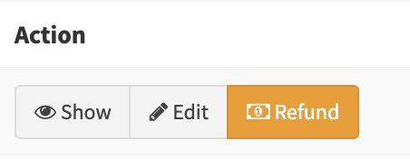

.. index::
    double: Reference; List field
    single: Template
    single: Usage
    single: Actions

List field definition
=====================

These fields are used to display the information inside the list table.

Example
-------

.. code-block:: php

    namespace Sonata\NewsBundle\Admin;

    use Sonata\AdminBundle\Admin\AbstractAdmin;
    use Sonata\AdminBundle\Form\FormMapper;
    use Sonata\AdminBundle\Datagrid\DatagridMapper;
    use Sonata\AdminBundle\Datagrid\ListMapper;
    use Sonata\AdminBundle\Show\ShowMapper;

    final class PostAdmin extends AbstractAdmin
    {
        protected function configureListFields(ListMapper $list): void
        {
            $list
                ->addIdentifier('title')
                ->add('author')
                ->add('enabled')
                ->add('tags')
                ->add('commentsEnabled')

                // add custom action links
                ->add('_action', 'actions', [
                    'actions' => [
                        'show' => [],
                        'edit' => [],
                    ]
                ])
            ;
        }
    }

Types available
---------------

The most important option for each field is the ``type``. The available `types` are the
``Sonata\AdminBundle\FieldDescription\FieldDescriptionInterface::TYPE_*`` constant.

.. note::

    For the `FieldDescriptionInterface::TYPE_MANY_TO_ONE` type, a link will be added to the related `show` action.

.. note::

    Entities with a class as identifier value (ex. `uuid <https://github.com/ramsey/uuid>`_)
    will resolve to the correct supported type::

        use Ramsey\Uuid\Uuid;

        class Example
        {
            /**
             * @var \Ramsey\Uuid\Uuid
             *
             * @ORM\Column(type="uuid")
             * @ORM\Id
             */
            private $id;

            public function __construct()
            {
                $this->id = Uuid::uuid4();
            }
        }

If no type is set, the ``Admin`` class will use the type defined in the Doctrine mapping definition.

List actions
------------

You can set actions for the list items by adding an '_action' field in ``configureListFields``::

    $listMapper
        ->add(ListMapper::NAME_ACTIONS, ListMapper::TYPE_ACTIONS, []
            'actions' => [
                'show' => [],
                'edit' => [],
            ]
        ]);

`Edit` and `Delete` actions are enabled in the default configuration. You can add your own!
Default template file is: ``@SonataAdmin/CRUD/list__action_[ACTION_NAME].html.twig``

You can specify your own by setting up the 'template' option like so::

    $listMapper
        ->add(ListMapper::NAME_ACTIONS, ListMapper::TYPE_ACTIONS, [
            'actions' => [
                'show' => [],
                'edit' => [],
                'delete' => ['template' => '@My/MyController/my_partial.html.twig'],
            ]
        ]);

Add new item in action list
---------------------------

You can add a new button in your action list.

let's add a new ``Refund`` button::

    $listMapper
        ->add(ListMapper::NAME_ACTIONS, ListMapper::TYPE_ACTIONS, [
            'actions' => [
                'show' => [],
                'edit' => [],
                'refund_payment' => ['template' => 'Admin/list__action_refund_payment.html.twig'],
            ]
        ]);

Add your twig file here ``templates/Admin/list__action_refund_payment.html.twig``::

    <a class="btn btn-sm btn-warning" href="#">
          <i class="fa fa-money"></i> Refund
    </a>

The result is:

Advance Usage
-------------

Displaying sub entity properties
^^^^^^^^^^^^^^^^^^^^^^^^^^^^^^^^

If you need to display only one field from a sub entity or embedded object in a dedicated column, you can simply use the dot-separated notation::

    namespace App\Admin;

    use Sonata\AdminBundle\Admin\AbstractAdmin;
    use Sonata\AdminBundle\Form\FormMapper;
    use Sonata\AdminBundle\Datagrid\DatagridMapper;
    use Sonata\AdminBundle\Datagrid\ListMapper;
    use Sonata\AdminBundle\Show\ShowMapper;

    final class UserAdmin extends AbstractAdmin
    {
        protected function configureListFields(ListMapper $list): void
        {
            $list
                ->addIdentifier('id')
                ->addIdentifier('firstName')
                ->addIdentifier('lastName')
                ->addIdentifier('address.street')
                ->addIdentifier('address.ZIPCode')
                ->addIdentifier('address.town')
            ;
        }
    }

.. note::

    This only makes sense when the prefix path is made of entities, not collections.

Custom template
^^^^^^^^^^^^^^^

If you need a specific layout for a row cell, you can define a custom template::

    namespace Sonata\MediaBundle\Admin;

    use Sonata\AdminBundle\Admin\AbstractAdmin;
    use Sonata\AdminBundle\Form\FormMapper;
    use Sonata\AdminBundle\Datagrid\DatagridMapper;
    use Sonata\AdminBundle\Datagrid\ListMapper;
    use Sonata\AdminBundle\Show\ShowMapper;

   final class MediaAdmin extends AbstractAdmin
    {
        protected function configureListFields(ListMapper $list): void
        {
            $list
                ->addIdentifier('id')
                ->add('image', 'string', ['template' => '@SonataMedia/MediaAdmin/list_image.html.twig'])
                ->add('custom', 'string', ['template' => '@SonataMedia/MediaAdmin/list_custom.html.twig'])
            ;
        }
    }

The related template:

.. code-block:: jinja

    

    
        

            <strong>{{ object.name }}</strong>  
            {{ object.providername}} : {{ object.width }}x{{ object.height }}  
        

    

Custom route
^^^^^^^^^^^^

Default route for a link is `show` (for `FieldDescriptionInterface::TYPE_MANY_TO_ONE` and `FieldDescriptionInterface::TYPE_ONE_TO_ONE`).
Using this, the route can be customized as follows::

    namespace Sonata\MediaBundle\Admin;

    use Sonata\AdminBundle\Admin\AbstractAdmin;
    use Sonata\AdminBundle\Form\FormMapper;
    use Sonata\AdminBundle\Datagrid\DatagridMapper;
    use Sonata\AdminBundle\Datagrid\ListMapper;
    use Sonata\AdminBundle\Show\ShowMapper;

    final class MediaAdmin extends AbstractAdmin
    {
        protected function configureListFields(ListMapper $list): void
        {
            $list
                ->addIdentifier('field', null, [
                    'route' => [
                        'name' => 'edit'
                    ]
                ]);
        }
   }
